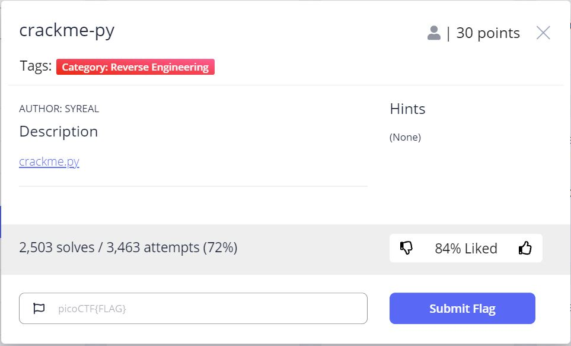

# crackme-py - picoCTF 2021 - CMU Cybersecurity Competition
Reverse Engineering, 30 Points

## Description



Attached file [crackme-py.py](crackme-py.py)

## crackme-py Solution

Let's observe the attached python file:
```python
# Hiding this really important number in an obscure piece of code is brilliant!
# AND it's encrypted!
# We want our biggest client to know his information is safe with us.
bezos_cc_secret = "A:4@r%uL`M-^M0c0AbcM-MFE067d3eh2bN"

# Reference alphabet
alphabet = "!\"#$%&'()*+,-./0123456789:;<=>?@ABCDEFGHIJKLMNOPQRSTUVWXYZ"+ \
            "[\\]^_`abcdefghijklmnopqrstuvwxyz{|}~"


def decode_secret(secret):
    """ROT47 decode

    NOTE: encode and decode are the same operation in the ROT cipher family.
    """

    # Encryption key
    rotate_const = 47

    # Storage for decoded secret
    decoded = ""

    # decode loop
    for c in secret:
        index = alphabet.find(c)
        original_index = (index + rotate_const) % len(alphabet)
        decoded = decoded + alphabet[original_index]

    print(decoded)


def choose_greatest():
    """Echo the largest of the two numbers given by the user to the program

    Warning: this function was written quickly and needs proper error handling
    """

    user_value_1 = input("What's your first number? ")
    user_value_2 = input("What's your second number? ")
    greatest_value = user_value_1 # need a value to return if 1 & 2 are equal

    if user_value_1 > user_value_2:
        greatest_value = user_value_1
    elif user_value_1 < user_value_2:
        greatest_value = user_value_2

    print( "The number with largest positive magnitude is "
        + str(greatest_value) )


choose_greatest()

```

We can see the secret variable: ```bezos_cc_secret = "A:4@r%uL`M-^M0c0AbcM-MFE067d3eh2bN"```.

The python file contains function ```decode_secret(secret)``` that never called, By calling it with the secret variable above we can get the flag:
```python
...
decode_secret(bezos_cc_secret)
```

Run it:
```console
┌─[evyatar@parrot]─[/pico2021/crackme-py] 
└──╼ $ python crackme-py.py
picoCTF{1|\/|_4_p34|\|ut_ef5b69a3}
```

Flag: ```picoCTF{1|\/|_4_p34|\|ut_ef5b69a3}```.

